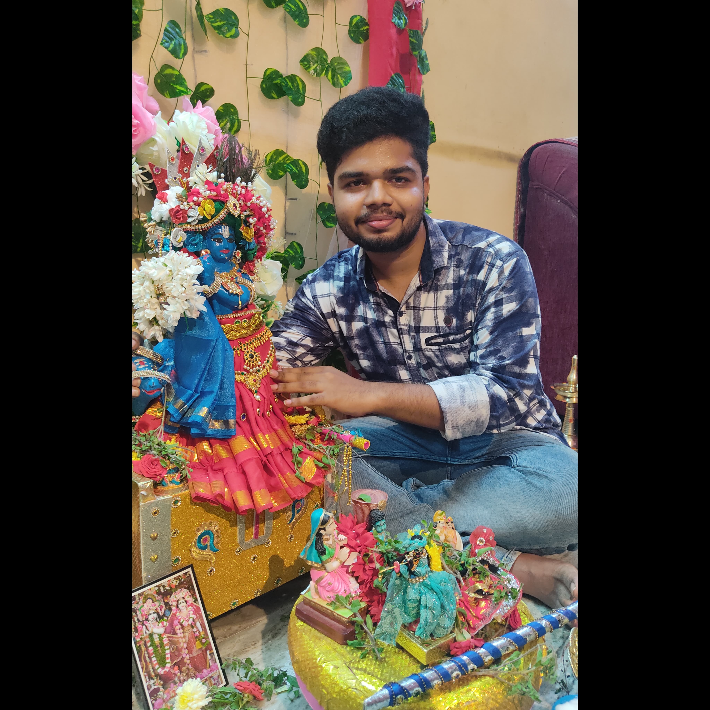

# 🎮📊 Harish Raghavendar G — Portfolio


> **"Learning, Living, and Leveling Up."**

Live at 👉 **[harish112233-rag.github.io](https://harish112233-rag.github.io/)**

---

## 👤 About

Hi, I'm **Harish Raghavendar G** — a dual-track enthusiast from Madurai, India.

- 🎮 **QA Game Tester** — I hunt bugs, design test cases, and document defects with precision
- 📊 **Data Scientist** — I build ML models, ETL pipelines, and KPI dashboards that drive decisions
- 🚀 **AI Intern @ Infosys Limited** (PMIS Program) — Mahindra World City, Chennai
- 🎓 **B.E. ECE** — PSNA College of Engineering and Technology | CGPA: 7.87

---

## 🗂️ Repo Structure

```
harish112233-rag.github.io/
│
├── index.html        ← Main portfolio page
├── style.css         ← All styles (Blue Cyberpunk theme)
├── main.js           ← All interactions & animations
├── README.md         ← You are here
│
└── assets/
    └── img/
        └── harish.jpg  ← (Add your photo here)
```

---

## ✨ Features

| Feature | Details |
|---|---|
| 🎨 Design | Blue cyberpunk theme with neon accents |
| 🖱️ Cursor | Custom animated cursor with ring trail |
| 🌐 Canvas | Live network node animation in hero |
| ⌨️ Terminal | Typing effect with real project outputs |
| 📊 Skill Bars | Animated progress bars on scroll |
| 🔢 Counters | Number count-up animation |
| 🃏 Card Tilt | 3D perspective tilt on hover |
| 🎯 Filter | Project filter by category (QA / Data / IoT) |
| 💌 Contact | Form with mailto integration |
| ⌨️ Shortcuts | Press `1`–`6` to jump between sections |
| 📱 Responsive | Fully mobile-friendly |
| ♿ Accessible | Semantic HTML, keyboard navigation |

---

## 🛠️ Tech Stack

- **HTML5** — Semantic structure
- **CSS3** — Custom properties, animations, clip-paths, grid
- **Vanilla JavaScript** — No frameworks, no dependencies
- **Google Fonts** — Orbitron, Rajdhani, JetBrains Mono

---

## 📸 Adding Your Photo

1. Add your photo to the `assets/img/` folder (name it `harish.jpg`)
2. In `index.html`, find this comment:
   ```html
   <!-- REPLACE src WITH YOUR PHOTO:  -->
   <span class="about-avatar-initials">HRG</span>
   ```
3. Replace the `<span>` lines with:
   ```html
   
   ```

---

## 🚀 Deploy to GitHub Pages

1. Upload all files to your repo: `harish112233-rag.github.io`
2. Go to **Settings → Pages**
3. Set source: **main branch / root**
4. Visit `https://harish112233-rag.github.io` — done! ✅

---

## 📬 Contact

| Platform | Link |
|---|---|
| 📧 Email | [harishraghav906@gmail.com](mailto:harishraghav906@gmail.com) |
| 📱 Phone | +91 98424 82478 |
| 💼 LinkedIn | [harish-raghavendar-g-62562b24a](https://linkedin.com/in/harish-raghavendar-g-62562b24a) |
| 💻 GitHub | [harish112233-rag](https://github.com/harish112233-rag) |
| 📸 Instagram | [@harish__g_](https://www.instagram.com/harish__g_/) |

---

## 🎯 Key Objective

> To join **Rockstar Games** as an Associate QA Tester — where analytical mindset, structured testing discipline, and strong documentation skills support high-quality gameplay experiences across large-scale titles.

---

<div align="center">

Made with 💙 by **Harish Raghavendar G**


</div>
